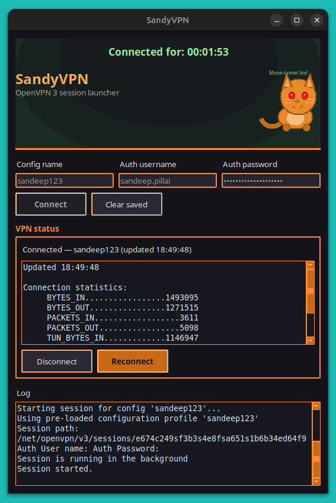

# SandyVPN

**OpenVPN 3, without the terminal fatigue.**

Tired of typing `openvpn3 session-start`, entering your username, waiting, then doing it all again tomorrow? SandyVPN is a small Linux desktop app that turns your VPN into a one-click habit — with a live connection dashboard, encrypted saved credentials, and a funny ginger cat to remind you to stop scrolling reels!



## Why SandyVPN?

**Connect in seconds, not minutes.**  
Save your profile once. Hit Connect. SandyVPN handles the rest.

**See your session at a glance.**  
A live timer, real-time stats, and one-click Disconnect or Reconnect — no tabbing back to a terminal.

**Credentials that stay yours.**  
Passwords are encrypted on disk and cleared from memory after use. Your login isn’t sitting in plain text waiting for the next session.

**Actually pleasant to use.**  
Dark UI, orange accents, a soft green glow when you’re connected, and a mascot that dozes off when the VPN’s down. Because VPN tools don’t have to feel like homework.

## What you get

- One-click connect to any imported OpenVPN 3 profile
- Encrypted credential storage (save once, connect many times)
- Live **Connected for** timer and session statistics
- Disconnect & reconnect without reopening a terminal
- Sleeping / awake cat mascot with a new pun every launch 🐈

---

## Requirements

- Linux with [OpenVPN 3](https://openvpn.net/community-docs/openvpn-client-for-linux.html) installed (`openvpn3` on your `PATH`)
- A configuration profile already imported (`openvpn3 configs-list`)
- Python 3.10+
- `python3-tk` and the `cryptography` package

```bash
sudo apt install python3 python3-tk python3-venv
```

## Install

```bash
./install.sh
```

That sets up a virtual environment, installs dependencies, and adds **SandyVPN** to your application menu and Desktop.

## Run

Open **SandyVPN** from your menu, or:

```bash
./launch.sh
```

---

**Quick start:** enter your config name, username, and password → **Save credentials** (first time) → **Connect**. Next time, just click Connect and go.

Built for personal use on a trusted Linux machine. Credentials are encrypted at rest; decrypt happens only when you connect.
